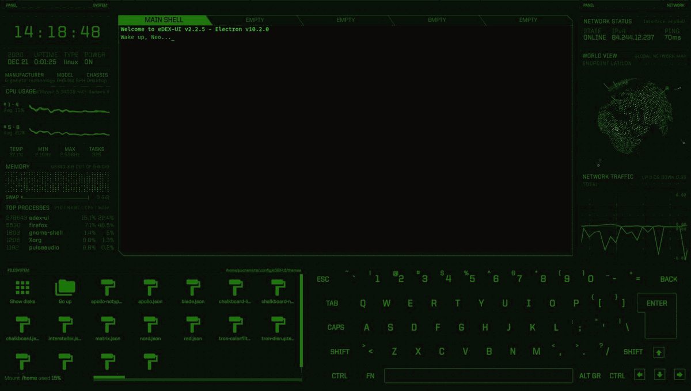
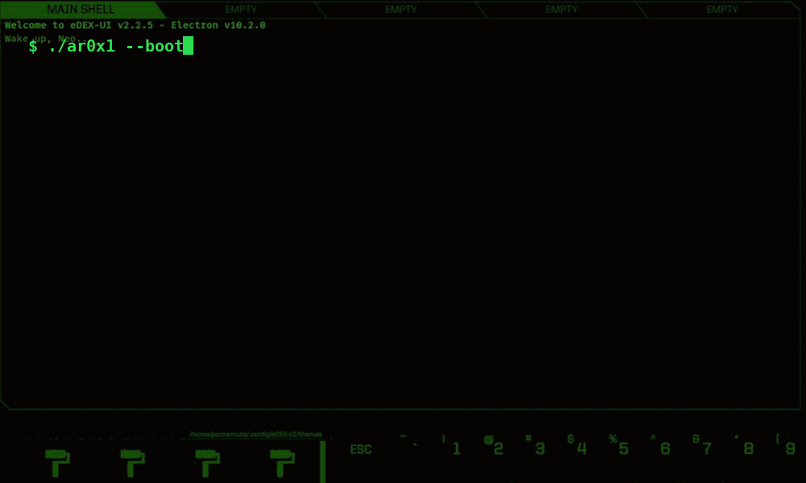
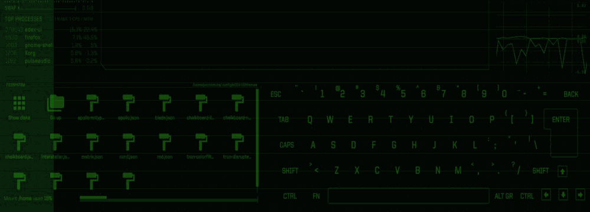

<div align="center">



<br>


</div>

---

## `> SYSTEM.IDENTITY`

```text
USER        : ar0x1
MODE        : BUILDER
FOCUS       : AI / CODE / AUTOMATION
ENVIRONMENT : LINUX / GITHUB
STATUS      : ONLINE
```

> **I build AI experiences, web projects, experiments, and developer tools.**

<div align="center">



</div>

---

## `> CURRENTLY.BUILDING`

- 🤖 **CHAT-BOT** — conversational AI / character experiences
- ⚡ **AURA-lang** — TypeScript project in the AURA ecosystem
- 🧪 Experiments across AI, automation, web, and developer tooling

---

## `> FEATURED.REPOSITORIES`

| PROJECT | DESCRIPTION |
|---|---|
| [CHAT-BOT](https://github.com/ar0x1/CHAT-BOT) | Conversational AI with custom avatar/persona experiences |
| [AURA-lang](https://github.com/ar0x1/AURA-lang) | TypeScript project in the AURA ecosystem |
| [x-ray-pack.zip](https://github.com/ar0x1/x-ray-pack.zip) | Experimental resource/model pack |

---

## `> ACTIVITY.MATRIX`

<div align="center">



</div>

---

## `> STACK`

```text
AI              ████████████████████
TYPESCRIPT      ██████████████████
WEB             █████████████████
AUTOMATION      ███████████████
LINUX           ██████████████
```

`TypeScript` `AI` `Web` `Git` `Linux` `Automation`

---

## `> CONNECT`

<div align="center">

[](https://github.com/ar0x1)
[](https://amaura-958223310232.asia-southeast1.run.app)

<br><br>

```text
BUILD > BREAK > LEARN > REPEAT
```

<sub>AR0X1 // MATRIX SYSTEM</sub>

</div>
