

  

 

  I build <b>AI systems</b>, experimental interfaces, and software that sits somewhere between <b>engineering</b> and <b>curiosity</b>.

 

  

 

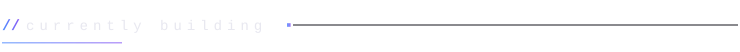

  

  <a href="https://github.com/ar0x1/AURA-lang"></a>

  <a href="https://github.com/ar0x1/CHAT-BOT"></a>

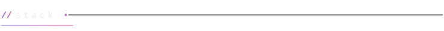

  


  

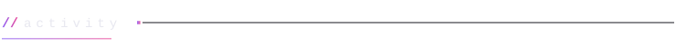

  

<!--
  Optional: one live GitHub stats card (kept off by default — the profile
  stays fully self-contained). Uncomment to enable.

  <picture>
    <source media="(prefers-color-scheme: dark)"
            srcset="https://github-readme-stats.vercel.app/api?username=ar0x1&show_icons=true&hide_border=true&bg_color=00000000&title_color=4F8CFF&icon_color=8B5CF6&text_color=8B8B98" />
    
  </picture>
-->


  

  
    
  <code>build → break → learn → repeat</code>

 

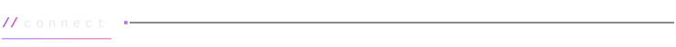

   
  <a href="https://github.com/ar0x1">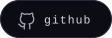</a>
  &nbsp;
  <a href="https://github.com/ar0x1/AURA-lang"></a>
  &nbsp;
  <a href="https://github.com/ar0x1/CHAT-BOT">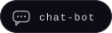</a>

 

  ar0x · <a href="#top">back to top ↑</a>

