indie builder · shipping small experiments, mostly alone

 

---

## about

Solo builder. Currently deep in **AURA** — a personal AI project with a live web app and an in-progress language/runtime component. Small profile, real repos — nothing here is padded.

## currently building

- **AURA** — the umbrella project behind `AURA-lang` and the deployed app below
- **CHAT-BOT** — a conversational AI interface with custom character avatars

## featured projects

<table>
<tr>
<td width="50%" valign="top">

**[🤖 CHAT-BOT](https://github.com/ar0x1/CHAT-BOT)**
Conversational AI chatbot with custom avatar personas and a recorded demo.

</td>
<td width="50%" valign="top">

**[⚡ AURA-lang](https://github.com/ar0x1/AURA-lang)**
Early-stage TypeScript project, part of the AURA ecosystem.

</td>
</tr>
</table>

<a href="https://amaura-958223310232.asia-southeast1.run.app">↳ open the live AURA app</a>

## stack

## activity

## connect

 

build · break · learn · repeat

