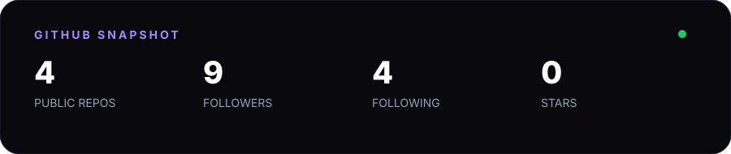
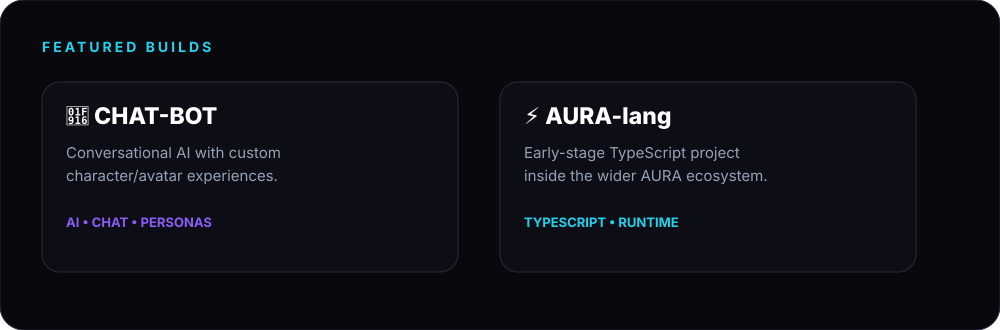

 

---

## `> whoami`

**Solo builder** exploring AI, software, automation, and weird little experiments that turn into real projects.

> I like building first, learning fast, and shipping what survives the process.

### currently building

- 🤖 **AURA** — the umbrella project behind `AURA-lang` and the deployed AURA app
- 💬 **CHAT-BOT** — conversational AI with custom character/avatar experiences
- ⚡ Small experiments across web, AI, and developer tooling

---

## `> stack`

**Core:** `TypeScript` · `AI` · `Web` · `Git` · `Linux`

---

### featured repositories

| Project | What it is |
|---|---|
| [🤖 CHAT-BOT](https://github.com/ar0x1/CHAT-BOT) | Conversational AI with custom avatar/persona experiences |
| [⚡ AURA-lang](https://github.com/ar0x1/AURA-lang) | Early-stage TypeScript project in the AURA ecosystem |
| [📦 x-ray-pack.zip](https://github.com/ar0x1/x-ray-pack.zip) | Experimental resource/model pack |

---

  

### `BUILD • BREAK • LEARN • REPEAT`

<a href="https://github.com/ar0x1">GitHub</a> ·
<a href="https://amaura-958223310232.asia-southeast1.run.app">AURA</a>

  

crafted with curiosity · ar0x

