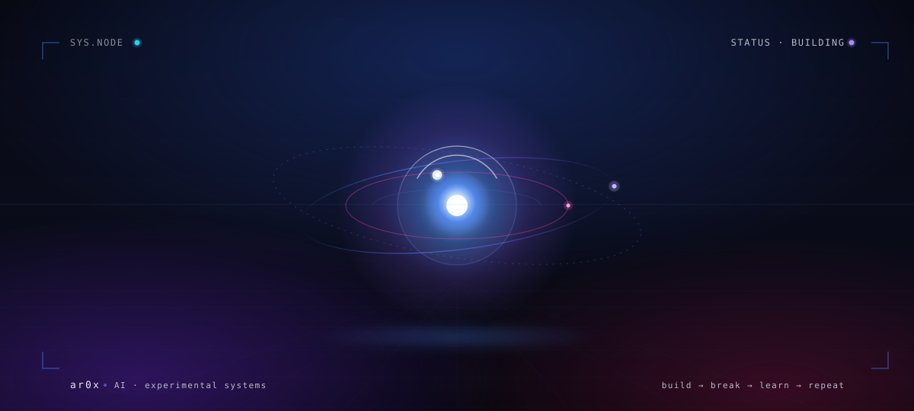
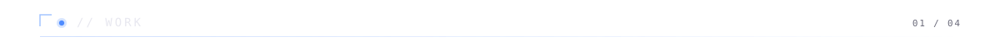
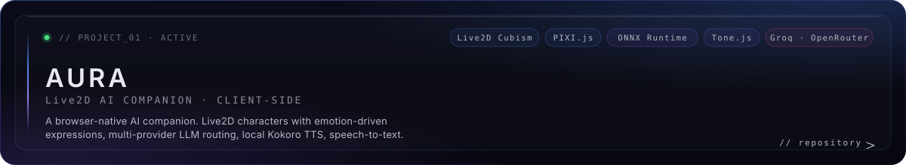
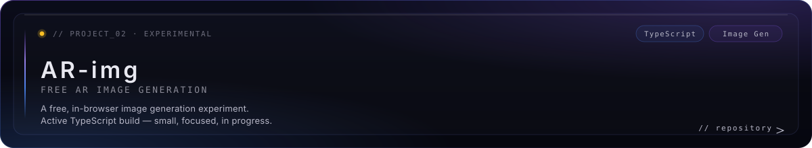
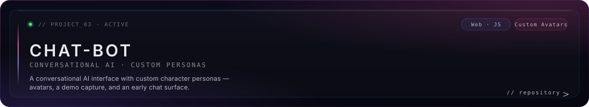
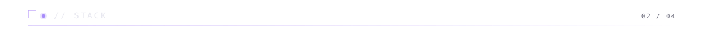
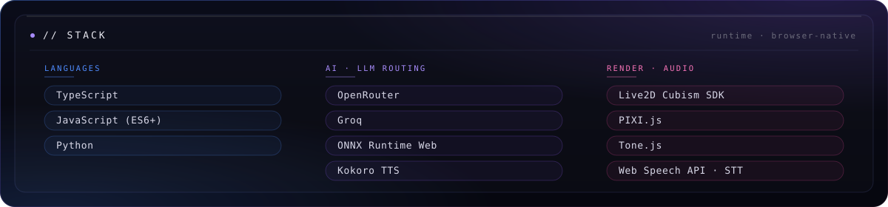
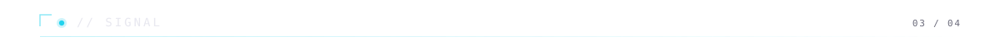
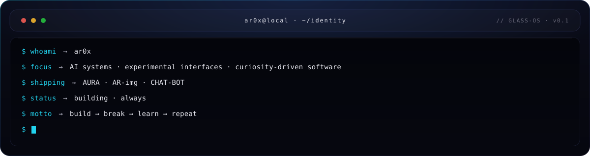
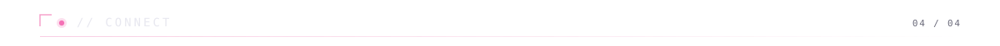

<!-- ar0x · glassmorphic AI identity · all visuals are self-contained SVG panels -->
<!-- Designed for GitHub README rendering — no JS, no external CSS, no runtime dependencies -->

  

 

  I build <b>AI systems</b>, experimental interfaces, and software 
  that sits somewhere between <b>engineering</b> and <b>curiosity</b>.

 

  

 

<!-- ============== // WORK ============== -->

 

 

 

 

<!-- ============== // STACK ============== -->

 

 

<!-- ============== // SIGNAL ============== -->

 

 

<!-- ============== // CONNECT ============== -->

 

  
  &nbsp;
  
  &nbsp;
  

 

  ar0x · <a href="#top">back to top ↑</a>

